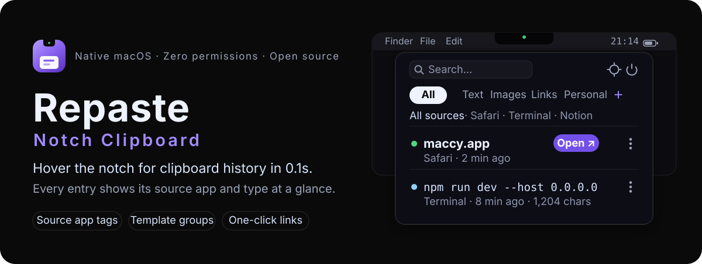

<p align="center">
  
</p>

<p align="center">
  <a href="README.md">简体中文</a> · <a href="README.en.md">English</a>
</p>

<p align="center">
  <a href="#download--installation"></a>
  <a href="#technical-architecture"></a>
  <a href="#dependencies"></a>
  <a href="#license"></a>
</p>

> **This repository is an improved fork of [klosexf/Repaste](https://github.com/klosexf/Repaste)**, maintained under the original MIT license with performance optimizations, interaction fixes, and feature enhancements. The original author's copyright and license are in [LICENSE](LICENSE).

**Repaste (Notch Clipboard)** is a native macOS clipboard manager. Hover the notch of your MacBook for a moment and the clipboard history drops down from the notch; or press `⌥⇧V` anytime to summon it from the center of the screen. Every entry shows **which app it came from and what type it is**; frequently used content can be saved as **template groups**, and links open in your browser **with one click**. Everything stays on your machine with **zero system permissions**.

## Features

- **Two summoning entrances** — notch hover drops the panel from the notch; `⌥⇧V` centers it. Both share the same list and behave identically.
- **Reliable on fast entry** — the hot zone is calibrated so quickly flicking the mouse into the notch triggers reliably (no more slowly brushing the edge).
- **Source app at a glance** — every entry shows its source app (icon + name), filterable by source, stackable with search and type tabs. Attribution is adapted for **background screenshot tools** (e.g. capcap).
- **Clipboard history** — text / image / link / file cards, auto-evicted at a 200-entry cap (pinned and template entries excluded), search-as-you-type.
- **Adjustable visible rows** — settings let the panel show a fixed 1–5 rows, with the rest scrolling inside the list (like a web page), with a scrollbar hint.
- **Custom template groups** — each group is a tab at the top of the panel; create as many as you like. `⌘G` turns any history entry into a template that never gets evicted.
- **One-click links** — the domain is bolded (phishing protection); click "Open" to jump to the browser, or hold `⌥` to temporarily pick a browser.
- **⋮ more menu** — intelligently matched by content type: "Copy Plain Text" for text, "View Image" for images, plus Save to Group / Pin / Delete.
- **Accidental-trigger protection** — a three-stage state machine (dwell threshold / leave delay / cooldown); fullscreen apps are suppressed by default, and the top-left/right screen corners (menu bar and Control Center territory) never trigger.
- **Works without a notch** — non-notch Macs and external displays automatically fall back to a top floating capsule that appears when the mouse nears the top edge; on multi-display setups the panel opens on the screen the mouse is on.

## Download & Installation

### Requirements

- macOS 15.0 or later
- No system permissions required

### Download

Grab the latest archive (e.g. `Repaste-v0.1.1.zip`) from **[Releases](https://github.com/VincentPhoton/Repaste/releases)**:

1. Unzip and drag **Repaste.app** into the Applications folder
2. Open Repaste from Applications

> This version is distributed for developers and is not signed with a paid Apple Developer certificate (same as the original). On first launch, macOS may show "cannot be opened because the developer cannot be verified" — the normal gatekeeper block for unsigned apps. Allow it via: System Settings → Privacy & Security → click "Open Anyway"; or right-click the app → Open → Open; or run `xattr -cr /Applications/Repaste.app` in Terminal.

### Build from Source (Developers)

Requires Xcode 16+ and the macOS 15+ SDK. Zero third-party dependencies — no Swift Package / CocoaPods resolution needed.

```bash
git clone https://github.com/VincentPhoton/Repaste.git
cd Repaste
open Repaste/Repaste.xcodeproj   # ⌘R in Xcode to run
```

### First Run

A short onboarding guides you: welcome → privacy & local storage → try hovering the notch. No system permissions are requested; by default selecting an entry writes it back to the clipboard — press `⌘V` in any app to paste. Only if you enable "Paste into the active app" in Settings will Accessibility permission be requested; declining falls back to copy-only mode.

## Shortcuts

| Key | Action |
| --- | --- |
| `⌥⇧V` | Show / hide the panel |
| `↑` `↓` | Select entry |
| `⏎` | Use (write back to clipboard, dismiss) |
| `⌘⏎` | Open link |
| `⌘G` | Save to template group |
| `⌫` | Delete entry |
| `esc` | Close the panel |

## Privacy

- **Fully local storage** — no login, no upload, no sync; history and images stay on your machine
- **Passwords auto-skipped** — concealed content copied from password managers (1Password, Keychain, etc.) is never stored
- **Zero permissions by default** — only the optional "Paste into the active app" requires Accessibility
- **Data under control** — images auto-clean after 7 days (TTL); view storage overview or clear history/images in Settings

## Improvements in This Fork

Compared with upstream [klosexf/Repaste](https://github.com/klosexf/Repaste):

**Performance**
- Event log writes moved to a background serial queue: no main-thread disk blocking on every click / capture
- Thread-safe memory caches for images and source icons: no repeated decoding while scrolling or reopening previews
- List thumbnails and preview images decode in the background: smooth scrolling, no dropped frames on large images

**Features**
- New **"Visible rows"** setting (1–5): the panel shows a fixed N rows and scrolls inside the list, like a web page
- New **"Source attribution enhancement"** setting (off by default): when a screenshot tool grabs focus, images are attributed to the app you were using before it
- **Instant hover tooltips** (~0.12s, cursor-following) on the settings `?` icon and the panel's "Unknown source" labels, guiding users to the enhancement setting

**Fixes**
- Fast notch entry now triggers reliably (deeper hot zone + cursor-position polling fallback)
- White line at the panel's top edge (window-shadow compositing artifact): shadow disabled + panel top raised off-screen, keeping bottom/side depth
- ⋮ menu no longer hidden by the notch: the panel reserves transparent space for the menu (menu overlays the app below — no black block, no dark frame), and every row is fully visible
- Source attribution withstands transient screenshot-tool activation (capcap and similar background tools attribute to the current frontmost app)
- The panel is a rounded rectangle from the very first summon (transparent-window first-frame square issue solved via a layer corner mask)

## Technical Architecture

Pure native macOS: SwiftUI for UI, AppKit for windows (the main panel is a borderless NSPanel that never steals focus).

| Layer | Technology |
| --- | --- |
| UI views | SwiftUI (panel, cards, settings, onboarding) |
| Window layer | AppKit (NSPanel / NSWindow / global tooltip panel) |
| Data layer | SwiftData (Clip / TemplateGroup on SQLite) + UserDefaults |
| State management | Observation (`@Observable`) |
| Global hotkey | Carbon RegisterEventHotKey (no permissions) |
| Clipboard monitoring | NSPasteboard.changeCount polling (≈0 idle CPU) |
| Third-party dependencies | None |

## Roadmap

This fork has **no preset roadmap** — it iterates on demand: new features are developed when there's a personal need or user feedback.

Feature requests and bug reports are welcome via [Issues](https://github.com/VincentPhoton/Repaste/issues).

## Dependencies

Zero third-party dependencies.

## License

[MIT](LICENSE) · Original © 2026 陈晓峰 ([klosexf/Repaste](https://github.com/klosexf/Repaste)) · This fork maintained by [VincentPhoton](https://github.com/VincentPhoton)

---

<p align="center">Hover the notch and give it a try.</p>
