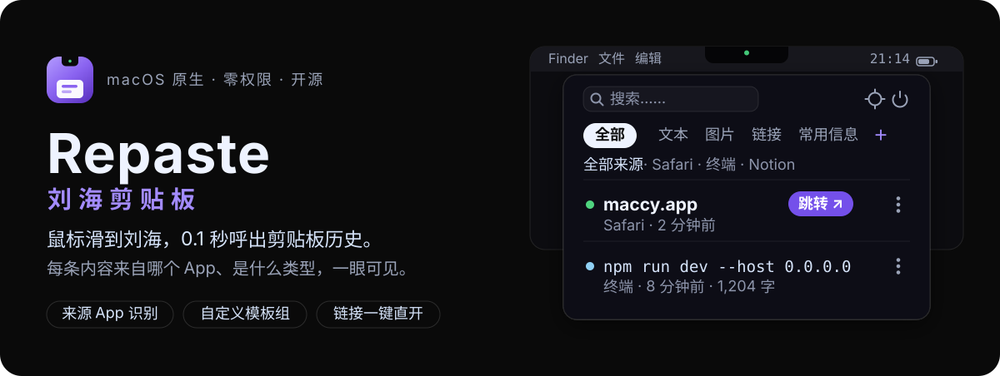

<p align="center">
  
</p>

<p align="center">
  <a href="README.md">简体中文</a> · <a href="README.en.md">English</a>
</p>

<p align="center">
  <a href="#下载与安装"></a>
  <a href="#技术架构"></a>
  <a href="#依赖"></a>
  <a href="#license"></a>
</p>

> **本仓库是 [klosexf/Repaste](https://github.com/klosexf/Repaste) 的改进分支（fork）**，在原作 MIT 许可下做了性能优化、交互修复与功能增强，并持续独立迭代。原作者的版权与许可声明见 [LICENSE](LICENSE)。

**Repaste（刘海剪贴板）** 是一款 macOS 原生剪贴板管理器。把鼠标滑到 MacBook 刘海停留片刻，剪贴板历史就从刘海向下展开；也可以随时按 `⌥⇧V` 从屏幕中央呼出。每条历史都标注**来自哪个 App、是什么类型**，常用内容可以沉淀为**模板组**，链接**一键直达浏览器**。所有数据只存在本机，**零系统权限**即可使用。

## 功能特性

- **双入口呼出**——刘海悬停呼出下拉面板，`⌥⇧V` 屏幕居中呼出；两个入口共用同一列表，体验完全一致
- **快速滑入也能触发**——热区深度经过校准，鼠标快速滑进刘海同样可靠触发，不再需要缓慢「蹭」到边缘
- **来源 App 一眼可见**——每条历史显示来源应用（图标 + 名称），可按来源筛选，并能与搜索、类型标签叠加过滤；来源归因对**后台截图工具**（如 capcap）做了专门适配
- **剪贴板历史**——文本 / 图片 / 链接 / 文件四类卡片，200 条上限自动淘汰（固定与模板条目除外），输入即搜
- **可调显示条数**——设置中可让面板固定显示 1–5 条记录，更多内容在列表内上下滚动（像网页一样），滚动条提示可滚动
- **自定义模板组**——每个模板组是面板顶部一个标签页，可建任意多个；`⌘G` 把任意历史一键沉淀为模板，不参与淘汰
- **链接一键直开**——域名加粗突出（防钓鱼），点「跳转」直达浏览器；按住 `⌥` 可临时选择用哪个浏览器打开
- **⋮ 更多菜单**——按内容类型智能匹配：文本「无格式复制」、图片「查看大图」，以及通用的存入模板组 / 固定置顶 / 删除
- **防误触设计**——停留阈值 / 离开延迟 / 冷却期三段状态机；全屏应用默认抑制，屏幕左右上角（菜单与控制中心领地）永不抢触发
- **无刘海也能用**——非刘海 Mac 与外接显示器自动切换为顶部悬浮胶囊，鼠标靠近即浮现；多屏只在鼠标所在的屏幕展开

## 下载与安装

### 系统要求

- macOS 15.0 及以上
- 无需任何系统权限即可使用

### 下载

到 **[Releases](https://github.com/VincentPhoton/Repaste/releases)** 下载最新版压缩包（如 `Repaste-v0.1.1.zip`）：

1. 解压后把 **Repaste.app** 拖到「应用程序」文件夹
2. 在「应用程序」中打开 Repaste

> 当前版本面向开发者分发，未做付费 Apple 开发者代码签名（与原作一致）。首次启动时 macOS 可能提示「无法打开，因为来自身份不明的开发者」「无法验证开发者」或「无法检查是否包含恶意软件」，这是未签名应用的正常拦截，可按以下任一方式放行：
>
> 1. **系统设置放行**：系统设置 → 隐私与安全性 → 安全性，滚到底部点击「仍要打开」。
> 2. **右键打开**：在 Finder 的「应用程序」中找到 Repaste，右键 → 打开，在弹出的确认框中点击「打开」。
> 3. **终端移除隔离属性**：
>    ```bash
>    xattr -cr /Applications/Repaste.app
>    ```
>    执行后再次双击打开即可。

### 从源码构建（开发者）

要求：Xcode 16+、macOS 15+ SDK。项目**零第三方依赖**，无需 Swift Package / CocoaPods 解析。

```bash
git clone https://github.com/VincentPhoton/Repaste.git
cd Repaste
open Repaste/Repaste.xcodeproj   # 在 Xcode 中 ⌘R 直接运行
```

### 首次运行

首次启动会有简短引导：欢迎页 → 隐私与本地存储说明 → 试试把鼠标滑到刘海。全程**不索要任何系统权限**，默认模式下选中条目即写回剪贴板，回到任意应用按 `⌘V` 粘贴。若在设置中开启「直接粘贴到正在使用的应用」，才会单独提示需要辅助功能权限，拒绝则自动回落为仅复制模式。

## 快捷键

| 按键 | 动作 |
| --- | --- |
| `⌥⇧V` | 呼出 / 关闭面板 |
| `↑` `↓` | 选择条目 |
| `⏎` | 使用（写回剪贴板，面板收起） |
| `⌘⏎` | 打开链接 |
| `⌘G` | 存入模板组 |
| `⌫` | 删除条目 |
| `esc` | 关闭面板 |

## 隐私

- **纯本地存储**——不登录、不上传、不同步，历史与图片全部存在本机
- **密码自动跳过**——从 1Password / 钥匙串等应用复制的密码类内容（ConcealedType）完全不入库
- **零权限可用**——默认无需任何系统授权；仅「粘贴到正在使用的应用」这一可选项需要辅助功能授权
- **数据可控**——图片 7 天自动清理（TTL），可在设置中查看存储概览、清空历史或图片

## 本分支的改进

相比上游 [klosexf/Repaste](https://github.com/klosexf/Repaste)，本分支包含：

**性能**
- 事件日志改为后台串行队列写入：消除每次鼠标点击 / 剪贴板入库的主线程磁盘阻塞
- 图片与来源图标增加线程安全内存缓存：滚动列表、重复打开预览不再反复解码
- 列表缩略图与预览大图改为后台解码：滚动图片行、打开大图不掉帧

**功能**
- 设置新增「**显示记录条数**」（1–5 条）：面板固定显示 N 行、列表内滚动，像网页一样
- 设置新增「**来源归因增强**」（默认关，按需开启）：截图工具抢焦点时，图片归因到截图前你正在使用的 App
- 设置项 ? 图标与面板「未知来源」悬停**即时提示**（约 0.12s 弹出，跟随光标），引导用户去设置开启增强

**修复**
- 快速滑入刘海不触发的问题（热区加深 + 光标位置轮询兜底）
- 面板顶边白色细线（窗口阴影在贴屏处的合成产物）：关闭阴影 + 顶部上抬到屏外，保留底部/两侧层次感
- ⋮ 菜单被刘海遮挡：菜单打开时面板为菜单预留空间（透明扩展区，菜单盖在下方应用上，无黑块无暗框），每条记录完整显示
- 来源归因抗截图工具瞬态激活（capcap 等后台工具正确归因到当前前台 App）
- 面板首次呼出即圆角矩形（透明窗口首帧直角问题，通过 layer 圆角遮罩解决）

## 技术架构

纯原生 macOS 开发，SwiftUI 构建 UI、AppKit 承载窗口（主面板为 borderless NSPanel，不抢前台焦点）。

| 层 | 技术 |
| --- | --- |
| UI 视图 | SwiftUI（面板、卡片、设置、引导） |
| 窗口层 | AppKit（NSPanel / NSWindow / 全局工具提示面板） |
| 数据层 | SwiftData（Clip / TemplateGroup，底层 SQLite）+ UserDefaults |
| 状态管理 | Observation（`@Observable`） |
| 全局热键 | Carbon RegisterEventHotKey（零权限） |
| 剪贴板监听 | NSPasteboard.changeCount 轮询（空闲 CPU ≈ 0） |
| 第三方依赖 | 无 |

## 路线图

本分支**不做预设路线图**，按需迭代：有新功能需求（自身使用需要或用户反馈）时再开发。

欢迎通过 [Issues](https://github.com/VincentPhoton/Repaste/issues) 提需求或反馈问题。

## 依赖

零第三方依赖。

## License

[MIT](LICENSE) · 原作 © 2026 陈晓峰（[klosexf/Repaste](https://github.com/klosexf/Repaste)）· 本分支由 [VincentPhoton](https://github.com/VincentPhoton) 维护

---

<p align="center">把鼠标滑到刘海，试一试。</p>
